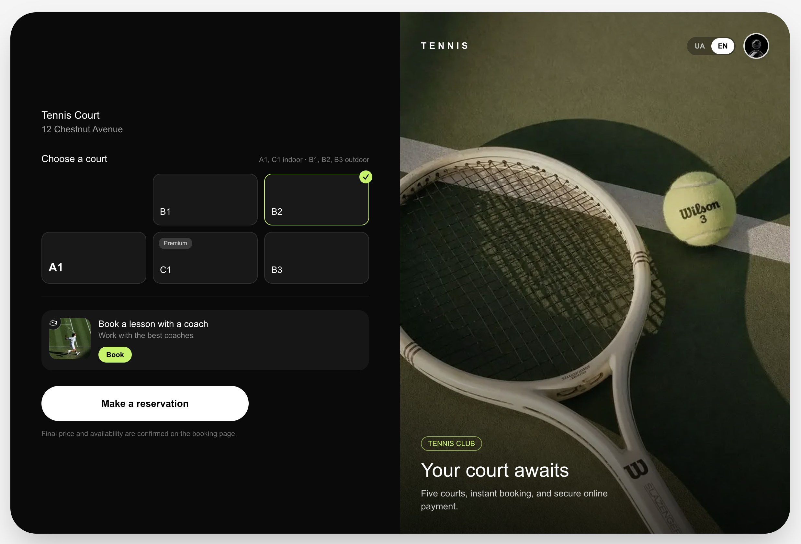
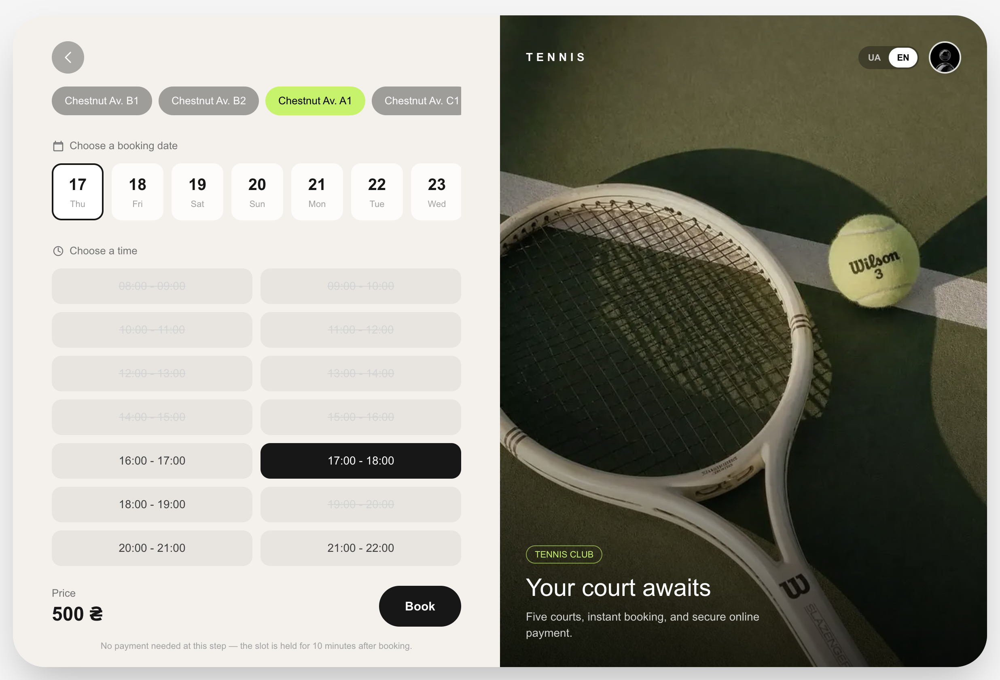
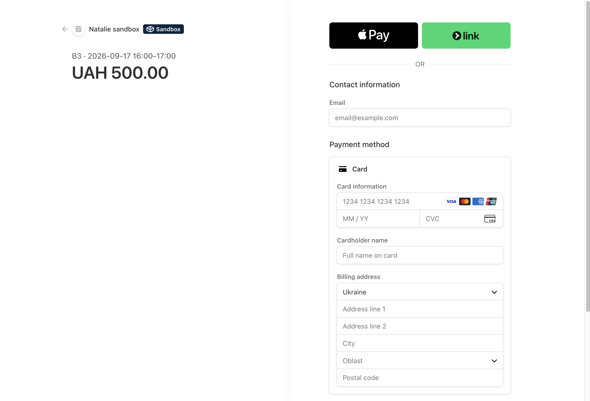
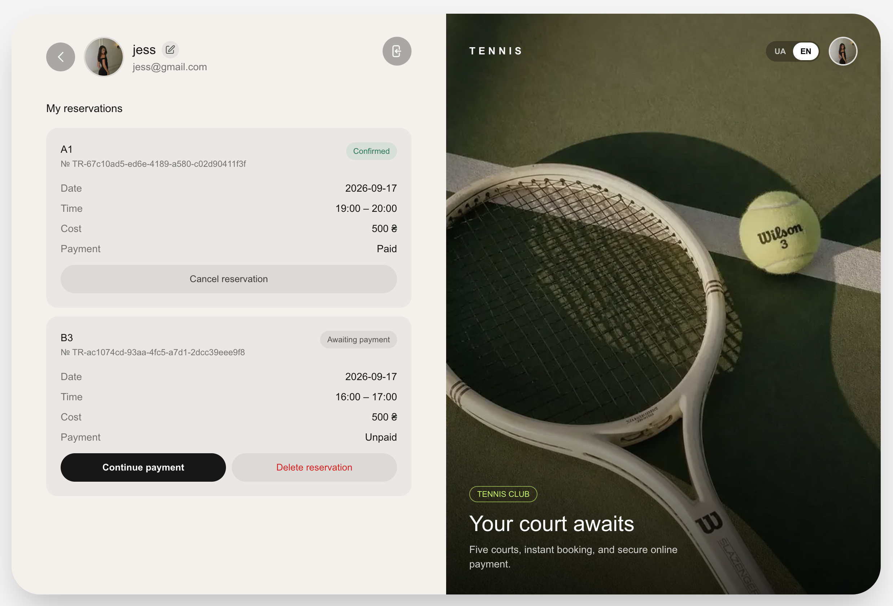
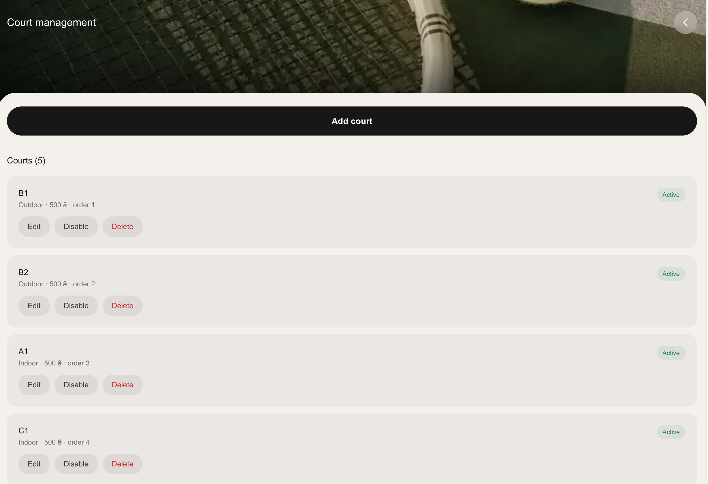

<div align="center">

# Tennis Court Reservation

*A full-stack court reservation platform built around real-time availability, webhook-verified payments, and database-enforced booking integrity.*



</div>

## Overview

Tennis Court Reservation is a self-directed concept project for a fictional single-venue tennis club in Ukraine, built to demonstrate a production-shaped full-stack implementation rather than a template with a booking form bolted on. Every reservation, payment, and permission check is enforced server-side against a real Postgres database — nothing about availability, booking, or payment confirmation is decided in the browser. Deeper implementation notes — schema, security model, the payment/webhook flow — live in [ARCHITECTURE.md](./ARCHITECTURE.md).

## Experience

The flow opens on a cinematic intro before settling into a mobile-first booking experience, with a two-column composition taking over on tablet and desktop rather than the mobile layout simply stretching wider. Court selection carries through from the home screen into the reservation page automatically, availability updates against the real database as the date changes, and the interface stays in Ukrainian by default with an English switch persisted across visits. Motion is used sparingly — reveal transitions on entry, nothing constant — and every animated element respects `prefers-reduced-motion`.

## Key Highlights

- **Database-enforced double booking protection** — availability is computed server-side in `Europe/Kyiv`, and the real guard against a double booking is a Postgres partial unique index on the active reservation for a court and time slot, not just an application-level check. Verified directly by firing two concurrent booking requests at the same slot.
- **Held, not booked** — creating a reservation opens a 10-minute pending-payment hold rather than confirming it outright. An unpaid hold is treated as available again the moment it expires, independent of whether the housekeeping cron has swept it yet.
- **Stripe Checkout, confirmed by webhook** — a reservation only becomes `CONFIRMED` once Stripe's signed webhook has been verified; the payment summary page polls for that confirmation rather than trusting the checkout redirect on its own.
- **Self-service account management** — cancel a confirmed reservation, or delete or resume payment on a still-pending one, directly from the account page.
- **Role-gated admin panel** — court management is restricted to an `ADMIN` role at both the page and API level; a non-admin visiting the route sees an ordinary 404, not a permissions error that confirms the route exists.
- **Defense-in-depth security** — Row Level Security enabled on every table, a hardened signup trigger that can't be invoked directly over the REST API, server-side rate limiting on auth and booking endpoints, and avatar uploads that are re-encoded through `sharp` rather than trusted by file extension alone.
- **Bilingual by default** — Ukrainian and English throughout, via `next-intl` with a persisted locale cookie rather than a locale URL prefix.

## Preview

<div align="center">

| Home | Reservation | Checkout |
| :---: | :---: | :---: |
|  |  |  |

| Account | Admin |
| :---: | :---: |
|  |  |

</div>

## Responsive Design

The mobile layout is the primary design, not a fallback — full-height photo panels, a rounded content sheet, and safe-area-aware spacing for real device notches. Tablet and desktop don't scale that layout up; they switch to a dedicated two-column composition (a form/content column beside a fixed venue panel), maintained as its own layout rather than derived from the mobile one, so neither breakpoint regresses when the other changes.

## Technology

- **Next.js (App Router)** — routing, server components, and API route handlers as the entire backend
- **TypeScript** — end to end, including Zod-inferred types at every API boundary
- **Tailwind CSS** — utility-driven styling with no separate component library
- **Framer Motion** — page and element transitions, reduced-motion aware
- **Supabase** — Postgres, Auth (session cookies via `@supabase/ssr`), and Storage for avatars
- **Prisma** — schema and migrations, connected through a `pg` driver adapter
- **Stripe** — Checkout Sessions and signed webhook confirmation (active payment provider)
- **next-intl** — Ukrainian/English localization
- **Zod** — input validation on every API route
- **date-fns / date-fns-tz** — DST-safe conversion between Kyiv wall-clock time and stored UTC instants

A parallel WayForPay integration exists in the codebase (HMAC-signed requests and webhook handling) but is dormant — kept intact for a real Ukrainian merchant account rather than deployed as the active provider. Stripe's hosted checkout also renders an Apple Pay button in test mode; it isn't claimed to complete real transactions, which needs a verified production domain and an Apple Developer account.

## Local Development

Requires a Supabase project (Postgres, Auth, Storage) and, for payments, a Stripe account in test mode.

```bash
npm install
cp .env.example .env.local   # fill in Supabase and Stripe values
npm run db:deploy            # apply migrations, including RLS policies and triggers
npm run db:seed              # seed courts and venue
npm run dev
```

## Project Type

Tennis Court Reservation is not a real club or business — it was designed and built independently, without a client, as a portfolio piece demonstrating full-stack implementation of authentication, database-backed availability, payments and webhooks, admin tooling, and security practices under a real (if fictional) product scope.
